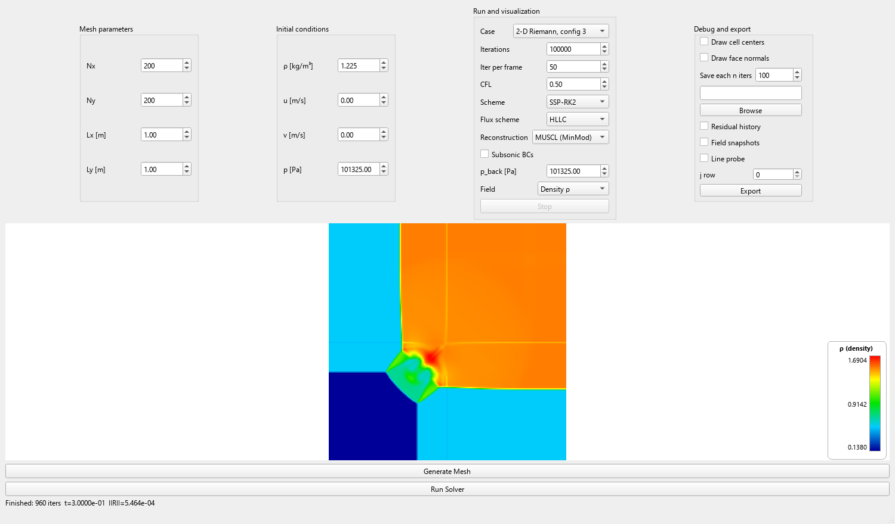
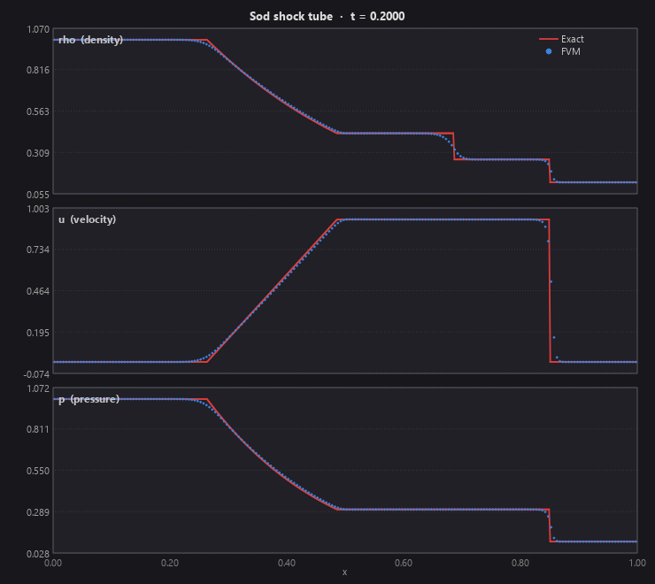
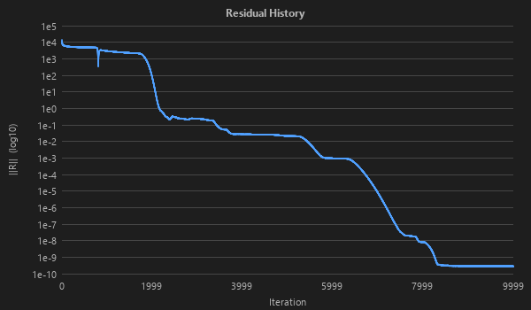
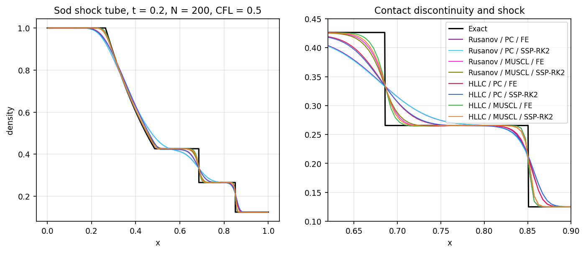
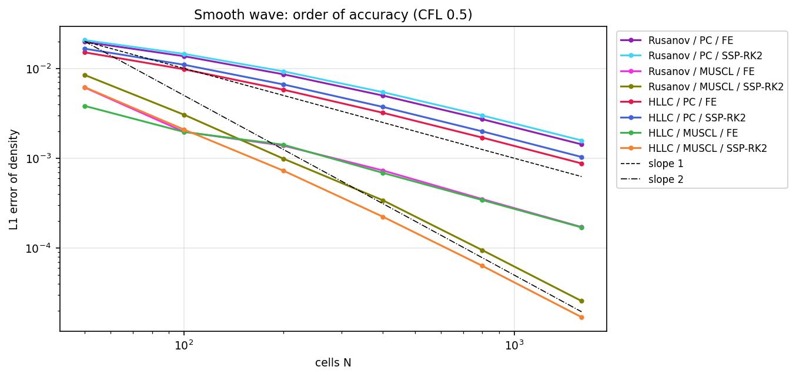
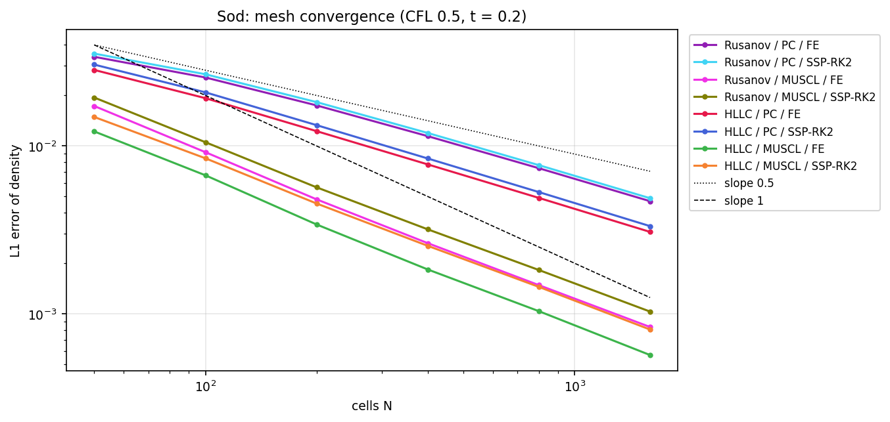
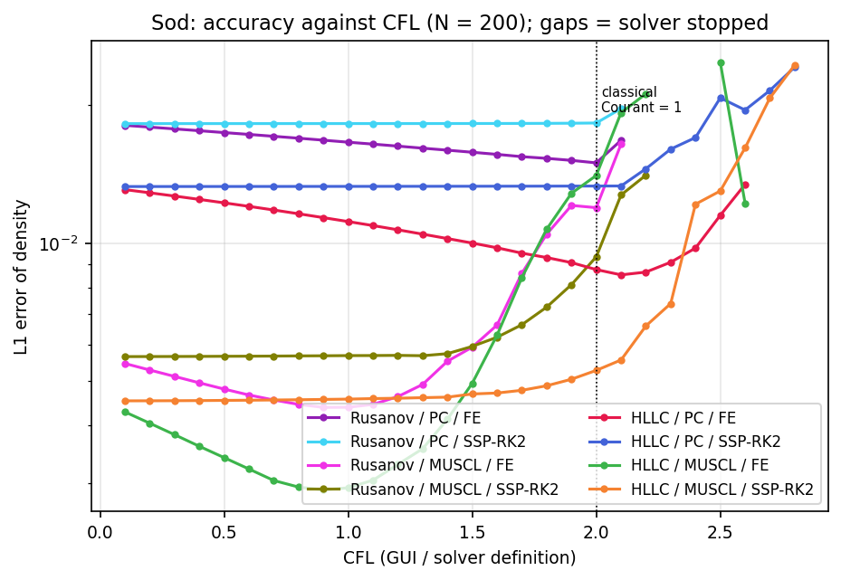
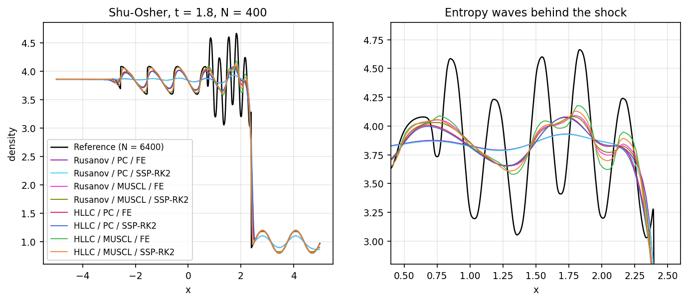
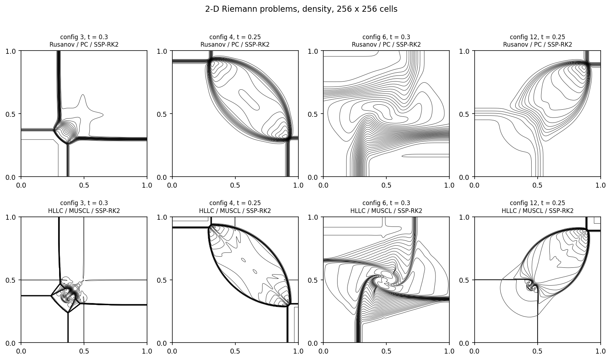

# Euler2D_FVM

[](https://github.com/luisvl99/Euler2D_FVM/actions/workflows/ci.yml)
[](LICENSE)


A finite-volume solver for the 2-D compressible Euler equations, written from scratch in C++17 with an interactive Qt 6 interface.



I built it for my Master's thesis (TFM) in the *Master in Computational and Mathematical Engineering* (URV & UOC). The goal was educational and comparative: I derived, implemented and validated every numerical building block by hand, then measured how each numerical choice affects accuracy on the Sod shock tube.

The numerical method is summarised in [docs/method.md](docs/method.md).

## Features

**Numerics**
- Structured Cartesian quadrilateral mesh. The assembly loop is face-based, so the scheme is conservative by construction.
- Numerical fluxes: **Rusanov** (local Lax–Friedrichs) and **HLLC** (pressure-based PVRS wave-speed estimates, Toro §10.5).
- Reconstruction: **piecewise constant** (first order) and **MUSCL** with the MinMod limiter.
- Time integration: **Forward Euler** and **SSP-RK2** (Heun / Shu–Osher), with a global CFL time step.
- Ghost-cell boundary conditions: slip wall, symmetry, supersonic inlet/outlet, **characteristic subsonic inlet/outlet** (Riemann invariants, prescribed back pressure), far-field and zero-gradient.
- An **exact Riemann solver** (Newton iteration, Toro ch. 4) serves as the validation reference.

**Built-in test cases**

| Case | What it tests | Domain | End time |
|------|---------------|--------|----------|
| Channel flow | Inlet/outlet BCs (supersonic or characteristic subsonic), slip walls | any | until stopped |
| Sod shock tube | Rarefaction, contact and shock against the exact solution | any, membrane at Lx/2 | 0.2 |
| Shu–Osher | Mach 3 shock running into a density wave: how well small-scale structure behind a shock survives the limiter | x ∈ [−5, 5] → `Lx = 10` | 1.8 |
| 2-D Riemann, configs 3, 4, 6, 12 (Lax & Liu) | Genuinely 2-D interactions of shocks, contacts and vortex sheets | unit square | 0.3 / 0.25 / 0.3 / 0.25 |
| Smooth wave | Order of accuracy: a Gaussian density bump advected at u = 2, with a smooth exact solution | any | 0.2 · Lx |

**GUI**
- Colour maps of ρ, |V|, u, v, p, Mach, specific total energy and residual |R|, with zoom and pan.
- Live residual-history plot (log scale).
- Live **1-D profile viewer** (ρ, u, p along one row) for Sod, Shu–Osher and the smooth wave, with the exact solution overlaid for Sod.
- CSV export of the residual history, full-field snapshots and 1-D line probes. Every file starts with a `#` metadata header recording the case, mesh, flow state, schemes and time.

<p>


</p>

## Results

Every figure and table below is produced by the scripts in [`analysis/`](analysis/README.md) with the current code (`python analysis/run_all.py`); the tables are also in [`docs/results`](docs/results). L1 is the mean absolute error over the cells. Unless stated otherwise, CFL = 0.5 (see the note on the CFL number below).

### Sod shock tube (t = 0.2)



Domain `Lx = 1` with N = 200 cells (`Ny = 1`), sorted from least to most accurate:

| Flux    | Reconstruction | Time scheme   | L1(ρ)    | L1(p)    |
|---------|----------------|---------------|----------|----------|
| Rusanov | PC             | SSP-RK2       | 0.018254 | 0.015354 |
| Rusanov | PC             | Forward Euler | 0.017447 | 0.014404 |
| HLLC    | PC             | SSP-RK2       | 0.013307 | 0.011470 |
| HLLC    | PC             | Forward Euler | 0.012256 | 0.010345 |
| Rusanov | MUSCL          | SSP-RK2       | 0.005669 | 0.004165 |
| Rusanov | MUSCL          | Forward Euler | 0.004807 | 0.003345 |
| HLLC    | MUSCL          | SSP-RK2       | 0.004542 | 0.003450 |
| HLLC    | MUSCL          | Forward Euler | 0.003406 | 0.002412 |

- **Reconstruction dominates.** Switching from piecewise constant to MUSCL cuts the density error by 3–3.6×.
- **Flux comes second.** HLLC improves on Rusanov by 20–30 %, mostly at the contact discontinuity.
- **On Sod, Forward Euler beats SSP-RK2** at this CFL. Its truncation error is anti-diffusive and cancels part of the spatial diffusion, as the modified equation shows. This does not carry over to smooth flow (next section).

### Order of accuracy

<p>


</p>

- **Smooth flow (left).** Piecewise constant converges at first order (0.92–0.96 between N = 800 and 1600). MUSCL reaches about second order (1.9) only with SSP-RK2; with Forward Euler the time error dominates and the order drops to 1.0. At N = 1600, MUSCL + SSP-RK2 is 10× more accurate than MUSCL + Forward Euler.
- **With discontinuities (right),** L1 converges more slowly than first order: about 0.65 for piecewise constant and 0.82–0.86 for MUSCL (N = 200 → 1600). The smeared contact discontinuity dominates the error.
- **Cost.** For the same Sod error, MUSCL on a coarse mesh is far cheaper than piecewise constant on a fine one: HLLC + MUSCL reaches L1(ρ) ≈ 3.4·10⁻³ with 200 cells, where HLLC + PC needs 1600 cells and about 40× more run time ([figure](docs/figures/sod_cost.png)).

### CFL number



- Every configuration runs to t = 0.2 up to CFL 2.1, which matches the classical Courant limit of 1 (see the note below).
- Forward Euler + piecewise constant gets *more* accurate as the CFL grows (less numerical diffusion). With MUSCL, Forward Euler is most accurate near CFL 0.9 and degrades quickly above it. SSP-RK2 is almost independent of the CFL up to about 1.5.
- Some HLLC runs survive up to CFL 2.8 but with growing errors: finishing without a non-physical state does not mean the scheme is stable or accurate there.

### Shu–Osher and 2-D Riemann problems



The ranking of the 8 configurations on Shu–Osher (error against an N = 6400 reference) is the same as on Sod. Rusanov + piecewise constant almost erases the entropy waves behind the shock (density range 3.78–3.93 against 3.05–4.66 in the reference). Rusanov even damps the stationary density wave ahead of the shock (amplitude 0.12 instead of 0.2 with piecewise constant), which HLLC keeps exactly.



The [channel study](docs/results/channel.md) shows the supersonic and the characteristic subsonic boundary conditions converging to machine precision ([residual histories](docs/figures/channel.png)).

## Download

Windows binaries of the GUI and of `euler_cli` (with the Qt runtime included) are attached to each [release](https://github.com/luisvl99/Euler2D_FVM/releases). Unzip and run `bin/Euler2D_FVM.exe`. On other systems, build from source.

## Building

Requirements: CMake ≥ 3.19 and a C++17 compiler. The GUI also needs Qt ≥ 6.5 (Core and Widgets). The code was developed with Qt 6.10 and MinGW 13.

```bash
cmake -S . -B build -DCMAKE_PREFIX_PATH=/path/to/Qt/6.x/<kit>
```

```bash
cmake --build build
```

You can also open `CMakeLists.txt` directly in Qt Creator.

Without Qt, turn the GUI off. The solver library, the command-line runner and the tests still build:

```bash
cmake -S . -B build -DEULER_BUILD_GUI=OFF
```

### Command-line runner

`euler_cli` runs one case without the GUI and writes the same CSV files as the GUI export, plus a `run.json` summary. This makes parameter studies scriptable:

```bash
build/euler_cli --case sod --flux hllc --recon muscl --time rk2 --cfl 0.5 --nx 200 --out runs/sod
```

Every option has a default (the case's canonical mesh, HLLC + MUSCL + SSP-RK2, CFL 0.5); `euler_cli --help` lists them. The exit code is 0 when the run finishes, 1 for invalid arguments and 2 when the solution blows up, so scripts can detect unstable settings.

### Tests

`solver_tests` is a small headless executable with no Qt dependency. It runs in about a second and checks:
- the exact Riemann solver (Sod star state, and mirror symmetry of the rarefaction fans);
- boundary re-tagging when switching cases on the same mesh;
- the test cases with HLLC + MUSCL + SSP-RK2:
  - Sod: mass conservation and the L1 error against the exact solution;
  - Shu–Osher: the shock position (x ≈ 2.40), and that the density wave ahead of the shock is left exactly untouched (HLLC resolves stationary contacts exactly);
  - 2-D Riemann: config 3 stays symmetric about the diagonal, and all four configurations keep positive density and pressure;
- both fluxes: consistency, F(U, U) = F(U)·n, and antisymmetry under n → −n, for several face orientations;
- all 8 flux / reconstruction / time-scheme combinations keep a uniform oblique stream exactly uniform with far-field boundaries;
- the channel boundaries (supersonic and characteristic subsonic inlet/outlet, slip walls) hold a uniform stream when p_back = p;
- a closed box with slip walls conserves mass and energy to round-off while 2-D Riemann waves reflect off the walls;
- order of accuracy on a smooth density wave: piecewise constant is first order, MUSCL + SSP-RK2 is close to second order;
- robustness: HLLC stays finite for zero or negative pressure, and an unstable run (CFL twice the limit) stops with an error.

Run them with:

```bash
ctest --test-dir build --output-on-failure
```

## Usage

1. Set **Nx, Ny, Lx, Ly** and click **Generate Mesh**.
2. Choose the flux, reconstruction, time scheme and CFL.
3. Pick a **case** (see the table above). Each case sets its own boundary conditions, initial condition and end time:
   - **Channel flow** has an inlet on the left, an outlet on the right and slip walls top and bottom. The flow starts at rest with the GUI ρ and p. **Subsonic BCs** switches the inlet and outlet to the characteristic versions, which use the back pressure *p_back*.
   - **Sod**, **Shu–Osher** and the **smooth wave** are 1-D: a single row (`Ny = 1`) is enough. A live ρ/u/p profile window opens, with the exact solution overlaid for Sod.
   - Selecting **Shu–Osher** or a **2-D Riemann** configuration pre-fills its canonical mesh and switches the view to density. You still need to click **Generate Mesh**. If you run Shu–Osher on a mesh whose length is not `Lx = 10`, the GUI warns you and asks before running.
4. Click **Run Solver**. **Stop** can interrupt it at any time. If a cell's density or pressure stops being positive, the run stops and reports the cell, step and time; the failed field stays on screen.
5. To export, choose a directory and tick residuals, snapshots and/or a line probe (row *j*). The files open directly in pandas with `pd.read_csv(path, comment="#")`.

### A note on the CFL number

The time step is `Δt = CFL · min_C( Ω_C / Σ_faces λ_f A_f )`, where the sum runs over **all four faces** of each cell. This makes the GUI's CFL about **twice the classical Courant number**. For a quasi-1-D tube (Δy ≫ Δx), CFL = 1 in the GUI gives Δt ≈ 0.5 · Δx / max(|u| + c).

## Code layout

`src/core/` is the solver library (`euler_core`, no Qt). The Qt application (`src/gui/`) and the command-line runner (`src/cli/`) both link it.

| Files | Purpose |
|-------|---------|
| `src/core/mesh_*` | Nodes, faces (unit normals, left/right cells), cells, structured mesh generation |
| `src/core/physics_eulerstate.h`, `physics_primitivestate.h` | Conserved/primitive state with arithmetic operators |
| `src/core/physics_eulerphysics.*` | Thermodynamics, physical flux, Rusanov and HLLC fluxes (stateless) |
| `src/core/physics_boundarycondition.h` | Ghost-state boundary conditions and their factory |
| `src/core/physics_flowparameters.h` | Free-stream / inlet / back-pressure data |
| `src/core/physics_solver.*` | Residual assembly, MUSCL reconstruction, time step, FE / SSP-RK2, blow-up check |
| `src/core/physics_testcases.*` | Test cases: boundary tags, initial conditions, end times |
| `src/core/sod_exact.*` | Exact Riemann solver |
| `src/core/io_csv.*` | CSV output with the `#` metadata header (shared by the GUI and the CLI) |
| `src/gui/` | Qt interface: main window, mesh viewer, residual plot, 1-D profile viewer, CSV export |
| `src/cli/main.cpp` | Command-line runner `euler_cli` |
| `tests/tests.cpp` | Headless regression checks (plus CLI smoke tests in CMake) |
| `analysis/` | Python studies that drive `euler_cli` and produce `docs/figures` and `docs/results` |

## References

- E. F. Toro, *Riemann Solvers and Numerical Methods for Fluid Dynamics*, 3rd ed., Springer, 2009.
- R. J. LeVeque, *Numerical Methods for Conservation Laws*, Birkhäuser, 1992.
- G. A. Sod, "A survey of several finite difference methods for systems of nonlinear hyperbolic conservation laws", *J. Comput. Phys.* 27, 1978.
- B. van Leer, "Towards the ultimate conservative difference scheme V", *J. Comput. Phys.* 32, 1979.
- C.-W. Shu, S. Osher, "Efficient implementation of essentially non-oscillatory shock-capturing schemes, II", *J. Comput. Phys.* 83, 1989.
- P. D. Lax, X.-D. Liu, "Solution of two-dimensional Riemann problems of gas dynamics by positive schemes", *SIAM J. Sci. Comput.* 19, 1998.
- A. Kurganov, E. Tadmor, "Solution of two-dimensional Riemann problems for gas dynamics without Riemann problem solvers", *Numer. Methods Partial Differential Equations* 18, 2002.
- F. Moukalled, L. Mangani, M. Darwish, *The Finite Volume Method in Computational Fluid Dynamics*, Springer, 2016.

## Contributing

Bug reports and pull requests are welcome; see [CONTRIBUTING.md](CONTRIBUTING.md). Changes are listed in [CHANGELOG.md](CHANGELOG.md).

## Citation

If you use this code in your work, please cite it. The citation data is in [CITATION.cff](CITATION.cff); GitHub shows it under "Cite this repository".

## License

MIT. See [LICENSE](LICENSE).
